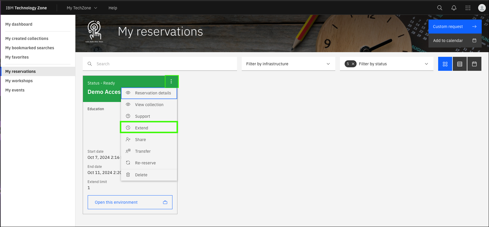

To demonstrate {{offering.name}}, an environment in IBM Technology Zone (ITZ) has been created. This environment mimics  a typical client deployment of {{offering.name}}, similar to this deployment architecture.
    

Follow the instructions to create a new reservation request, extend the reservation, and access the ITZ demonstration environment.

## Create a reservation request
Follow these steps to create a reservation in ITZ.

1. Click the following link to open a browser to the reservation page of the **{{itz.collectionName}}**.

    !!! Warning "You may be asked to authenticate to IBM Technology Zone"

        These steps are not detailed here.

    <a href="{{itz.environment}}" target="_blank">{{itz.collectionName}} - reservation page</a>

2. Click **Reserve now**.

    The **Reserve now** option requests that the reservation be created now. Optionally, schedule the reservation for late.

    

3. Complete the form and click **Submit**.

    **a**. Optionally, change the **Name** field for the reservation.

    **b**. Select the **Education** purpose tile.

    **c**. Enter a **Purpose description**.

    **d**. Select any geography in the **Preferred Geography** drop-down.

    **e**. The **End date and time** will be set to 2 days after the current date and time.

    !!! tip "Extending a reservation"

        The initial reservation duration is set by ITZ at 2 days and cannot be extended at the time the reservation is created. You can, and are encouraged to, extend the reservation once it is in the **Ready** state. Two extensions of 2 day increments are allowed. Steps to extend the reservation are shown below.

    **f**. Accept the IBM Technology Zone's terms and conditions and security policies.

    **g**. When satisfied with the parameters, click **Submit**.

    

## Extend the reservation
The ITZ provisioning process takes approximately 150 minutes. Multiple emails are sent from ITZ as the provisioning process runs. One email states the reservation is provisioning and the other email states that the environment is **Ready**. 

In rare cases, the provisioning process may fail. If you receive and email stating the reservation failed, try again by repeating steps 1-3.

When the reservation is in the **Ready** state, you can extend the reservation to a total of 6 days. Remember, IBM sellers need the environment to record their Stand and Deliver, and Business Partners need it while taking the quiz.

4. In the IBM Technology Zone portal, expand **My TechZone** and select **My Reservations**.

    

5. Click the **overflow icon** () on the reservation tile and select **Extend**.

    

6. Click the **Select a date** option, specify the date to extend to, and then click **Extend**.

    

If you anticipate needing more time, repeat steps 5 and 6 to extend the reservation to the maximum of 6 days.

## Access the environment
Access to the {{offering.name}} demonstration environment is provided through a web interface to a fictitious company's intranet web site.

7. Click the reservation tile in the ITZ My reservations page.

    

8. Click **Open your IBM Cloud environment**.

    

## The demonstration portal page
The demonstration portal page provides two ways of accessing the {{offering.name}} virtual assistant. 

### The chat icon
The first method is to use the assistant chat icon which appears at the bottom right of the page. Note, the "Hi! I'm a virtual assistant. How can I help you today?" dialog appears after a few seconds of inactivity after the page loads.

9. Click the **Virtual Assistant chat icon**.

    

This will open the virtual assistant on the current browser page as a pop-up dialog. This provides an integrated view of the web page and the virtual assistant dialog; however, the dialog is small for giving a demonstration if the audience is expected to read the output.

10.  Close the the **Virtual Assistant** dialog.

    

### The full page virtual assistant
The second user interface available for the virtual assistant is a full browser page experience.

11. Scroll to the bottom of the page and click **Techbot FS** under **Technology**.

    

    The full page virtual assistant interface opens in a new browser window or tab.

    

    The full page virtual assistant interface is used for all screen captures in later chapters.

### Using the virtual assistant
Using the virtual assistant powered by IBM watsonx is easy. Enter a query into the text field and press ++return++ or click the send icon ().
    

Proceed to the next chapters to begin using {{offering.name}}.