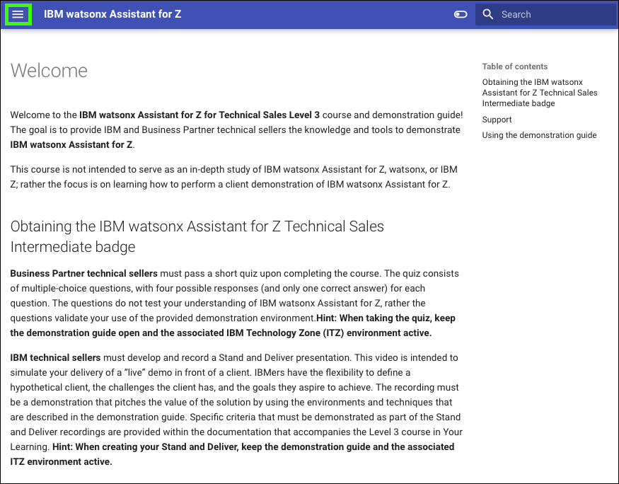

Welcome to the **{{learningplan.name}}** course and demonstration guide! The goal is to provide IBM and Business Partner technical sellers the knowledge and tools to demonstrate **{{offering.name}}**.

This course is not intended to serve as an in-depth study of {{offering.name}}, watsonx, or IBM Z; rather the focus is on learning how to perform a client demonstration of {{offering.name}}.

## Obtaining the {{badge.name}} badge
**Business Partner technical sellers** must pass a short quiz upon completing the course. The quiz consists of multiple-choice questions, with four possible responses (and only one correct answer) for each question. The questions do not test your understanding of {{offering.name}}, rather the questions validate your use of the provided demonstration environment. 

**IBM technical sellers** must develop and record a Stand and Deliver presentation. This video is intended to simulate your delivery of a “live” demo in front of a client. IBMers have the flexibility to define a hypothetical client, the challenges the client has, and the goals they aspire to achieve. The recording must be a demonstration that pitches the value of the solution by using the environments and techniques that are described in the demonstration guide. Specific criteria that must be demonstrated as part of the Stand and Deliver recordings are provided within the documentation that accompanies the Level 3 course in Your Learning. 

??? Tip "Keep the demonstration guide and ITZ environment active"
    
    Business Partners, keep the demonstration guide and ITZ environment active while you take the quiz. 

    IBM technical sellers, keep the demonstration guide and ITZ environment active until you complete your Stand and Deliver.

## Support
Think something is down? Check the applicable status pages for any known issues like a site or service not available:

-  <a href="https://techzone.status.io/" target="_blank">IBM Technology Zone</a>

For issues with provisioning the ITZ environment (for example, a failed reservation request due to insufficient quota capacity) open a ticket with ITZ support:

- Web:  <a href="https://ibmsf.force.com/ibminternalproducts/s/createrecord/NewCase?language=en_US" target="_blank">IBM Technology Zone</a>

- Email: <a href="mailto:techzone.help@ibm.com" target="_blank">techzone.help.ibm.com</a>

For issues related to specific steps found in the demonstration guide after the ITZ environment is provisioned, contact the authors:

- Slack: <a href="mailto:{{supportSlack.url}}" target="_blank">{{supportSlack.name}}</a> - IBM only
- Email: <a href="mailto:{{supportEmail}}" target="_blank">{{supportEmail}}</a>

Business Partners, use the IBM Training live Chat Support service or other support methods that are found on the IBM Training portal <a href="https://ibmcpsprod.service-now.com/its?id=sc_category&sys_id=6568bfafdb2f13008ea7d6fa4b961990" target="_blank">here</a>.

## Using the demonstration guide
The Level 3 demonstration guide is organized into multiple chapters, some which contain modules.

??? tip "The **Demonstration Guide** user interface"

    This **Demonstration Guide** uses a reactive browser-based interface. The Demonstration Guide table of contents may be displayed as highlighted in the green dashed box in this image:

    

    However, if the browser window is sized smaller, the table of contents is accessible by clicking the main menu icon () (highlighted by solid green box):

    

    Click the main menu icon () to expand the table of contents.

    

??? tip "Embedded images"

    In some images, the following styles of highlighting are used:

    - **Solid highlight box**: This style of box highlights where to click, enter, or select an item.
    

    - **Dash highlight box**: This style of box highlights one of two things: the path to follow to get to a specific location in the user interface, or areas to explore on your own.
    

    <!-- - **Copy to the clipboard**: The text is copied to the clipboard. Click the copy icon (highlighted) and then use the operating system paste function. For example, entering ```Ctrl+v```, ```Cmd+v```, or right-click and select ```Paste```.
     -->

    - **Copy to the clipboard**: The text is copied to the clipboard. Click the copy icon (highlighted) and then use the operating system paste function. For example, ++ctrl+v++, or right-click and select ```Paste```.
    

Acronyms that are not initially spelled out on a page may contain additional information accessible by hovering over the acronym. A question mark will first appear and after a second the acronym meaning is displayed. Try it here: LPAR. 