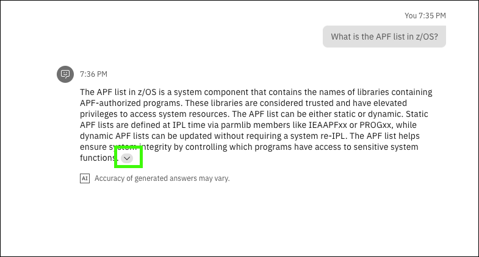
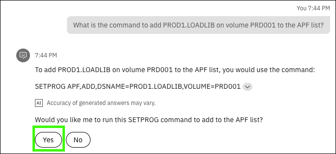
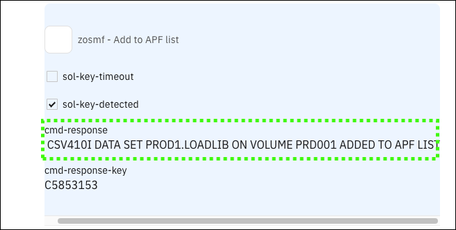

# Scenario: Authorized Program Facility
## Scenario overview
!!! Quote "Speaker's script"

    Imagine you are an early-tenure systems programmer (sysprog) that is tasked with updating the Authorized Program Facility (APF) authorized list on an logical partition (LPAR) and would like to quickly find guidance on doing this without having to read a bunch of manuals. In z/OS, the APF list includes information about libraries that contain APF-authorized programs. You would also like to take advantage of some simple automation to complete this task if possible. 
    
    As you will see, in the last prompt, {{offering.name}} will respond with the command you will need to run to add the library to the APF authorized list, followed by prompting you to run a skill (issuing a z/OS console command) on your behalf which will perform the task.

!!! Warning "Responses from the virtual assistant are likely to change"

    Responses generated by {{offering.name}} are likely to change over time. The responses you see when you run the queries may differ from the screen images captured in the {{guide.name}}. Using the exact queries specified will help assure a successful demonstration. Also, as updates to the environment are made, some confirmation dialogs may no longer be displayed as illustrated in the sample outputs.

## Prerequisite steps
None.
<div style="page-break-after: always;"></div>

## Prompts and sample outputs
!!! Tip "Copy and paste the prompt"

    Use the copy icon () to copy prompts from the demonstration guide and then paste the prompt into the Assistant using ++ctrl+v++ or right click and select ```Paste```.

1. Ask the assistant what the APF list is.

    <!--- begin-tab-group --->
    === "Prompt"

        ```
        What is the APF list in z/OS? Provide a detailed explanation?
        ```

    === "Sample output"
        
    <!--- end-tab-group --->

    !!! Quote "Speaker's script"

        Notice the detailed level of the response, and more importantly, notice the expandable section at the bottom of the response. 

2. Expand the results.

    !!! Quote "Speaker's script"

        If I expand the section, we see the referenced sources that were used to build the answer. This illustrates just part of the explainable AI capabilities of watsonx. Click on any of the document tiles to display the source document.

    <!--- begin-tab-group --->
    === "Sample input"

        

    === "Sample output"
    
                
    <!--- end-tab-group --->

3. Ask the assistant how to update the APF list.
    
    <!--- begin-tab-group --->
    === "Prompt"

        ```
        How do you update the APF list in z/OS?
        ```
    === "Sample output"

        
<!--- end-tab-group --->

4. Ask the assistant what the parmlib member to update the APF list. 

    <!--- begin-tab-group --->
    === "Prompt"

        ```
        What is the parmlib member to update the APF list in z/OS?
        ```

    === "Sample output"

        

    <!--- end-tab-group --->

5. Ask the assistant what is the command to add loadlib for a volume in the APF list.

    <!--- begin-tab-group --->
    === "Prompt"
    
        ```
        What is the command to add PROD1.LOADLIB on volume PRD001 to the APF list?
        ```
    
    === "Sample output"

        

    <!--- end-tab-group --->

6. Click **Yes** to run the command.
   
    

7. Click **Apply**

    <!--- begin-tab-group --->
    === "Sample input"

        Note, there are no additional parameters to fill in the form, hence the *“Form is empty”* message.
        
        

    === "Sample output"

        !!! Quote "Speaker's script"

            Notice the response for the command stating LOADLIB was added to the APF list.

                   
    <!--- end-tab-group --->

## Cleanup steps
None.
