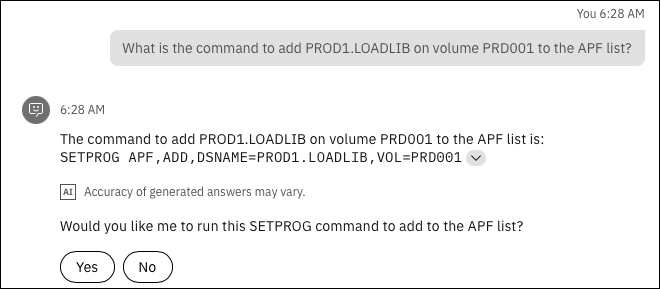
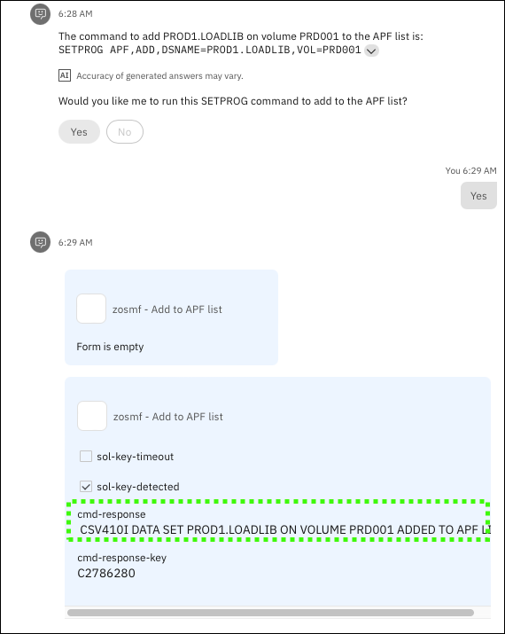

## Scenario overview

!!! Quote "Speaker's script"

    Imagine you are an early-tenure Sysprog that is tasked with updating the Authorized Program Facility (APF) authorized list on an logical partition (LPAR) and would like to quickly find guidance on doing this without having to read a bunch of manuals. In z/OS, the APF list includes information about libraries that contain APF-authorized programs. You would also like to take advantage of some simple automation to complete this task if possible. 
    
    As you will see, in the last prompt, the virtual assistant powered by IBM watsonx will respond with the command you will need to run to add the library to the APF authorized list, followed by prompting you to run a skill (issuing a z/OS console command) on your behalf which will perform the task.

## Prerequisites steps
None.

## Prompts and sample outputs

###### <ins>Prompt 1<ins>
```
What is the APF list in z/OS? Provide a detailed explanation.
```

??? Example "Sample output"

    


!!! Quote "Speaker's script"

    Notice the detailed level of the response, and more importantly, notice the expandable section at the bottom of the response. If I expand the section we see the referenced sources that were used to build the answer. This illustrates just part of the explainable AI of watsonx.

    ??? Example "Sample output"
    
        

###### <ins>Prompt 2<ins>

```
How do you update the APF list in z/OS?
```
??? Example "Sample output"

    
<!--- begin-tab-group --->
=== "Prompt 3"

    ```
    What is the parmlib member to update the APF list in z/OS?
    ```

=== "Sample output"

    

<!--- end-tab-group --->
<!--- begin-tab-group --->
=== "Prompt 4"
    
    ```
    What is the command to add PROD1.LOADLIB on volume PRD001 to the APF list?
    ```
    
=== "Sample output"

    
<!--- end-tab-group --->
!!! Abstract "Follow-up actions"

    Following the response, you’ll be prompted by the assistant to run the proposed automation on your behalf. 
    
    1. Click **Yes**.
    2. Click **Apply** to run the skill. 
        
        Note, there are no additional parameters to fill in the form, hence the *“Form is empty”* message. It will take about 30 seconds for the command to run.

    3. View the *"cmd-response"* field to verify the command was successful.

    ??? Example "Sample output"
    
        

## Cleanup steps
None.
