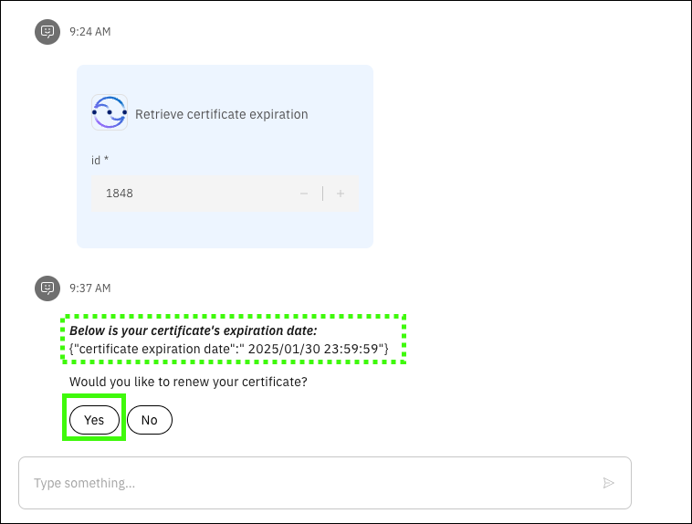

# Scenario: Certificate renewal 
## Scenario overview
!!! Quote "Speaker's script"

    Now, change your role to that of a security administrator. You have just been informed that one of your SSL certificates signed by a Certificate Authority is expiring soon. Secure Sockets Layer (SSL) certificates, sometimes called digital certificates, are used to establish an encrypted connection between communicating parties over a network. Certificate management is crucial for maintaining the security of our company's z/OS environment, but it has been a while since you have performed this action. You recall there are many steps required on z/OS and various RACF commands that need to be run to renew a certificate. Rather than going to your senior security administrator for assistance, you leverage watsonx Assistant for Z to help automate the certificate renewal process. By automating these processes with Ansible, you ensure critical certificates are always up to date and reduce the risk of expired certificates disrupting your services.

!!! Warning "Responses from the virtual assistant are likely to change"

    Responses generated by {{offering.name}} are likely to change over time. The responses you see when you run the queries in this section may differ from the screen images captured in the {{guide.name}}. Using the exact queries specified will help assure a successful demonstration. Also, as updates to the environment are made, some confirmation dialogs may no longer be displayed as illustrated in the Example outputs.

<div style="page-break-after: always;"></div>

## Prerequisite steps
To run this scenario, a certificate must first be created. 

??? Tip "Copy and paste the prompt"

    Use the copy icon () to copy prompts from this demonstration guide and then paste the prompt using ++ctrl+v++, or right click and select ```Paste```.

Using the virtual assistant:

1. Create a certificate.
    
    **Prompt:**

    ```
    create a certificate
    ```
    **Example output:**

    

<div style="page-break-after: always;"></div>
2. Complete the form for the **z/OS Certs - Create Cert** skill and click **Apply**.
  
    **Input values:**

    - **Certificate Label**: <*Enter a unique label of your choice, for example "yourNameCert". Record the label as it is needed later.*>
        - **CERT TYPE**: ```SITE```
        - **Expiration date**: <*Enter an expiration date within the next 30 days.*>
        - **Common name**: <*Enter a unique label of your choice, for example "company.com". Record the name as it is needed later. **Do NOT use test.com***>
        - **SIGN WITH**: ```CERTAUTH```
        - **SIGN LABEL**: ```TESTCA```   

        

<div style="page-break-after: always;"></div>   

    **Example output:**
    
    

The new certificate is created (despite the last message status of **pending**).

<div style="page-break-after: always;"></div>
## Prompts and Example outputs

1. Ask the assistant how to check on an expiring certificate.

    **Prompt:**

    ```
    I have a SSL certificate on z/OS expiring soon. How do I check when my certificate is going to expire?
    ```

    **Example output:**
    

2. Click **Yes** to retrieve the certificate details.
<div style="page-break-after: always;"></div>
3. Complete the form with the certificate label and type (use the same values as specified in the prerequisite steps) and click **Apply**.
 
    **Input values:**
   
    - **CERT LABEL**: <*Enter the unique label of the certificate created in the setup steps.*>
    - **CERT TYPE**: ```SITE```

    

<div style="page-break-after: always;"></div>

    **Example output:**
    
    
<div style="page-break-after: always;"></div>
4. Wait approximately 10 seconds and then click **Apply**.

5. Ask the assistant how to renew a certificate.

    **Prompt:**

    ```
    What are the steps to renew a certificate on z/OS?
    ```

    **Example output:**
    
<div style="page-break-after: always;"></div>
6. Click **Yes** to run the certificate renewal skill.
7. Complete the form to renew the certificate and click **Apply**.

    **Input values:**

    - **CERT LABEL**: <*Enter the same label of the certificate created in the setup steps.*>           
    - **CERT TYPE**: ```SITE```
    - **SIGN WITH**: ```CERTAUTH```
    - **SIGN LABEL**: ```TESTCA```
    - **extra_vars.new_expiry_date_survey**: <*Enter an expiration date on year from today.*>
    
    
 
    **Example output:**

    No output is returned.

!!! Warning "Wait approximately 1 minute before continuing"

    The search and renew skills just run can take up to a minute to complete. Wait a minute before proceeding.
<div style="page-break-after: always;"></div>
8. Retrieve this renewed certificate and verify the date was changed.
 
    **Prompt:**

    ```
    Get my certificate details.
    ```

    **Example output:**
    
<div style="page-break-after: always;"></div>
9. Complete the form with the certificate label and type (use the **same** values as specified in the prerequisite steps) and click **Apply**.
    
    **Input values:**
   
    - **CERT LABEL**: <*Enter the unique label of the certificate created in the setup steps.*>
    - **CERT TYPE**: ```SITE```

    

<div style="page-break-after: always;"></div>

    **Example output:**
    
    

10. Wait approximately 10 seconds and then click **Apply**.
<div style="page-break-after: always;"></div>
## Cleanup steps
Following the demo, cleanup the system by deleting the original certificate created.

Using the virtual assistant:

1. Delete the certificate.
  
    **Prompt:**

    ```
    delete cert
    ```

    **Example output:**

    
<div style="page-break-after: always;"></div>
2. Complete the form and click **Apply**.
 
    **Input values:**

    - **CERT LABEL**: <*Enter the original certificate label that you created.*>
    - **CERT TYPE**: ```SITE```

    

    **Example output:**
    
    