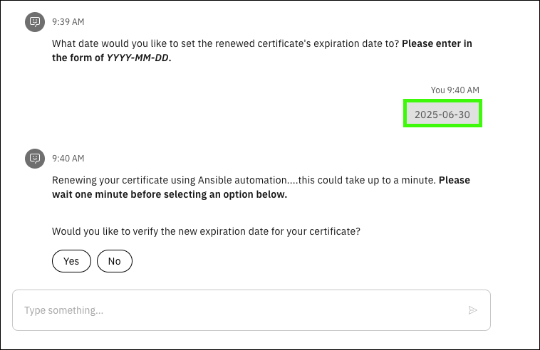
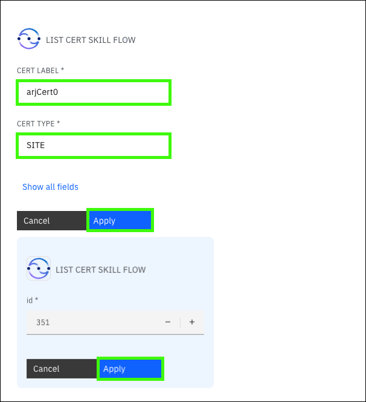

# Scenario: Certificate renewal
!!! Bug "This scenario not working as documented!"

    As of 09/26/2024, when performing this scenario all submitted jobs seem to be stuck in a *pending* state.
    Waiting for guidance.
    
## Scenario overview

!!! Quote "Speaker's script"

    Let us change our role to that of a security administrator. We have just been informed that one of our SSL certificates signed by an existing Certificate Authority is expiring soon. Secure Sockets Layer (SSL) certificates, sometimes called digital certificates, are used to establish an encrypted connection between communicating parties over a network. Certificate management is crucial for maintaining the security of our z/OS environment, but it has been a while since we have performed this action. We recall there are many steps required on z/OS and various RACF commands that need to be run to renew the certificate. Rather than going to our senior security administrator for assistance, let us leverage our virtual assistant powered by watsonx to help automate the certificate renewal process. By automating these processes with Ansible, we can ensure the certificates are always up to date and reduce the risk of expired certificates disrupting our services.
??? warning "Responses from the virtual assistant may change"

    Responses are subject to change as updates are made to  {{offering.name}} and the LLM and RAG used in the demonstration environment. The responses you see when you run the queries may differ from the screen images captured in the {{guide.name}}.
    
## Prerequisites steps
These steps should be performed before demonstrating the prompts to the client. To run this scenario, a certificate must first be created. Using the virtual assistant, perform the following actions.

1. Enter **create cert**.

    The **create cert** skill will return a form that needs to be completed.

2. Complete the form using these values:

    - **Certificate Label**: <*Enter a unique label of your choice, for example "<your name>Cert". Be sure to remember the name as it will be needed later.*>
    - **CERT TYPE**: SITE
    - **Expiration date**: <*Enter an expiration date within the next 30 days.*>
    - **Common name**: test.com
    - **SIGN WITH**: CERTAUTH
    - **SIGN LABEL**: TESTCA
  
    ??? Example "Sample input"

        

    The virtual assistant will return a job number and a status.

    ??? Example "Sample ouptut"

        

## Prompts and sample outputs
<!--- begin-tab-group --->
=== "Prompt 1"

    ```
    I have an SSL certificate on z/OS expiring soon. How do I check when my certificate is going to expire?
    ```

=== "Sample output"
    
<!--- end-tab-group --->
!!! Abstract "Follow-up steps"

    <!--- begin-tab-group --->
    === "Actions"

        Following the response, the assistant will prompt if you want to retrieve the certificate details. 
    
        1. Click **Yes**.
        2. Complete the form using these values: 
        
            - **CERT TYPE**: SITE
            - **Certificate Label**: <*Enter the unique label of the certificate created in the setup steps.*>

        3. Click **Apply**.

            Another form will return showing the corresponding **ID** for the previous job.

        4. Click **Apply**.
   
            Highlight the current expiration date (displayed as **End Date**) of the certificate.

    === "Sample output"
    
        
        
    <!--- end-tab-group --->
<!--- begin-tab-group --->
=== "Prompt 2"

    ```
    What are the steps to renew a certificate on z/OS?
    ```

=== "Sample output"
    
<!--- end-tab-group --->
!!! Abstract "Follow-up steps"

    <!--- begin-tab-group --->
    === "Actions"

        Following the response, the assistant will prompt if you want to run the certificate renewal skill. 
    
        1. Click **Yes**.
        2. Complete the form using these values: 
        
            - **CERT LABEL**: <*Enter the unique label of the certificate created in the setup steps.*>           
            - **CERT TYPE**: SITE
            - **SIGN WITH**: CERTAUTH
            - **SIGN LABEL**: TESTCA
            - **extra_vars.new_expiry_date_survey**: <*Enter an expiration date on year from today.*>

        3. Click **Apply**.

            Another form will return showing the corresponding **ID** for the previous job.

        4. Click **Apply**.
   
            No response will be returned and you can assume the playbook executed successfully to renew the certificate.

    === "Sample output"
    
        
        
    <!--- end-tab-group --->
<!--- end-tab-group --->
<!--- begin-tab-group --->
=== "Prompt 3"

    ```
    Get my certificate details.
    ```

=== "Sample output"
    
<!--- end-tab-group --->
!!! Abstract "Follow-up steps"

    <!--- begin-tab-group --->
    === "Actions"

        Again, a skill is run to retrieve your certificate details following the renewal. 
    
        1. Complete the form using these values: 
        
            - **CERT LABEL**: <*Enter the unique label of the certificate created in the setup steps.*>  
            - **CERT TYPE**: SITE
            <!-- - **SIGN WITH**: CERTAUTH
            - **SIGN LABEL**: TESTCA -->

        2. Click **Apply**.

            Another form will return showing the corresponding **ID** for the previous job.

        3. Click **Apply**.
   
            You will now be able to view the details of your certificate following the renewal execution. Notice the new expiration date of your certificate, indicating that the certificate was renewed and won’t expire for another year.

    === "Sample output"
    
        
        
    <!--- end-tab-group --->
<!--- end-tab-group --->
## Cleanup steps
Following the demo, cleanup the system by deleting the original certificate created. Using the virtual assistant, perform the following actions.

1. Enter **delete cert**.

    This will return a form to fill out. 

2. Enter in the following values into the fields
   
    - **CERT LABEL**: <*Enter the original certificate label you created.*>
    - **CERT TYPE**: SITE

3. Click **Apply**.
