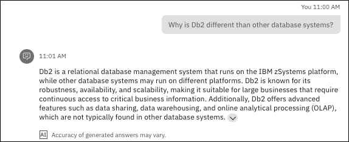
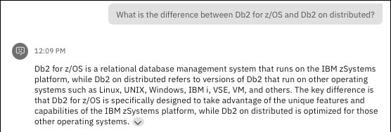
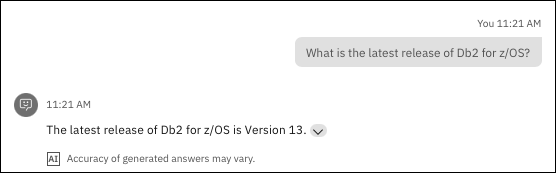
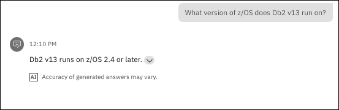
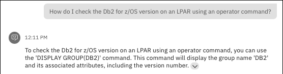
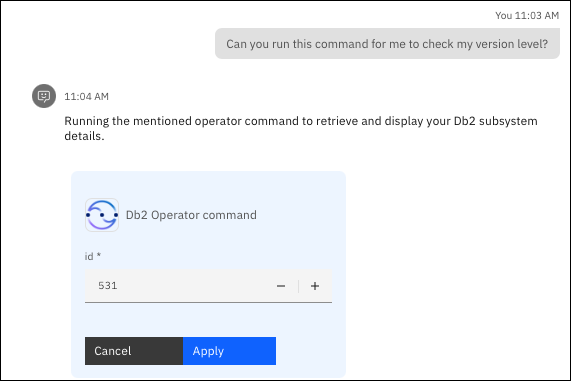
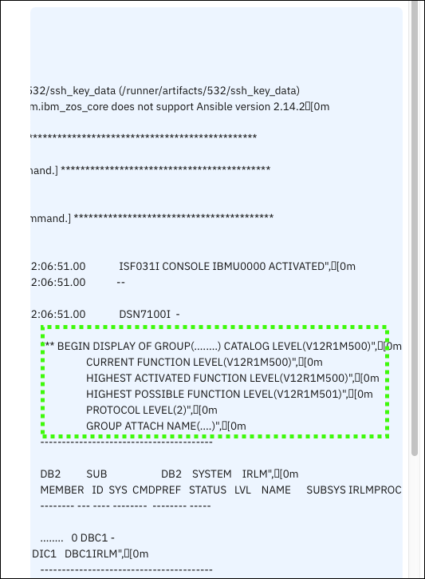
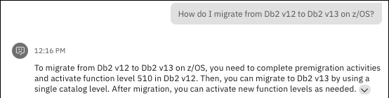

## Scenario overview

!!! Quote "Speaker's script"

    We are now a new database administrator and need to quickly familiarize ourselves with the Db2 subsystem in our company's mainframe environment. We would like to understand more about Db2 on z/OS versus other platforms, the latest  supported version of Db2, and the process for migrating to a newer version. Most early-tenure DBAs don't have this experience. We leverage an our virtual assistant that is customized with pre-existing automation the team has in place. And by leveraging the RAG grounded on Z specific knowledge, we have confidence that the responses generated from our questions are accurate. We like the fact that they can go to one place to get answers to any question, on-demand, and can help automate some of our tasks, which in turn reduces our learning curve and increases our efficiency.

## Prerequisites steps
None.

## Prompts and sample outputs
<!--- begin-tab-group --->
=== "Prompt 1"

    ```Why is Db2 different than other database systems?```

=== "Sample output"
    
<!--- end-tab-group --->
<!--- begin-tab-group --->
=== "Prompt 2"

    ```What is the difference between Db2 for z/OS and Db2 on distributed?```

=== "Sample output"
    
<!--- end-tab-group --->
<!--- begin-tab-group --->
=== "Prompt 3"

    ```What is the latest release of Db2 for z/OS?```

=== "Sample output"
    
<!--- end-tab-group --->
<!--- begin-tab-group --->
=== "Prompt 4"

    ```What version of z/OS does Db2 v13 run on?```

=== "Sample output"
    
<!--- end-tab-group --->
<!--- begin-tab-group --->
=== "Prompt 5"

    ```How do I check the Db2 for z/OS version on an LPAR using an operator command?```

=== "Sample output"
    
<!--- end-tab-group --->
<!--- begin-tab-group --->
=== "Prompt 6"

    ```Can you run this command for me to check my version level```

=== "Sample output"
    
<!--- end-tab-group --->
!!! Abstract "Follow-up"

    <!--- begin-tab-group --->
    === "Actions"

        A skill is triggered to use an Ansible playbook that runs the referenced operator command to return the Db2 details. 
    
        1. Click **Apply**.

            Point out the Db2 version levels on the LPAR.

    === "Sample output"
    
        
    <!--- end-tab-group --->
<!--- end-tab-group --->
<!--- begin-tab-group --->
=== "Prompt 7"

    ```How do I migrate from Db2 v12 to Db2 v13 on z/OS?```

=== "Sample output"
    
<!--- end-tab-group --->
## Cleanup steps
None.

<!-- Abbreviations -->
*[LPAR]: Logical Partition
*[OS]: Operating System
*[RAG]: Retrieval-Augmented Generation