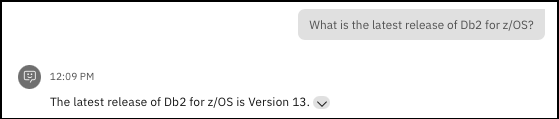
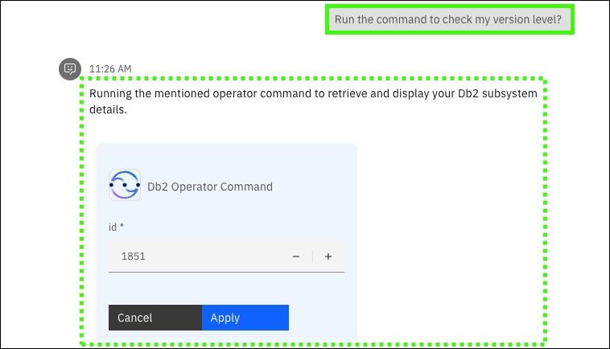
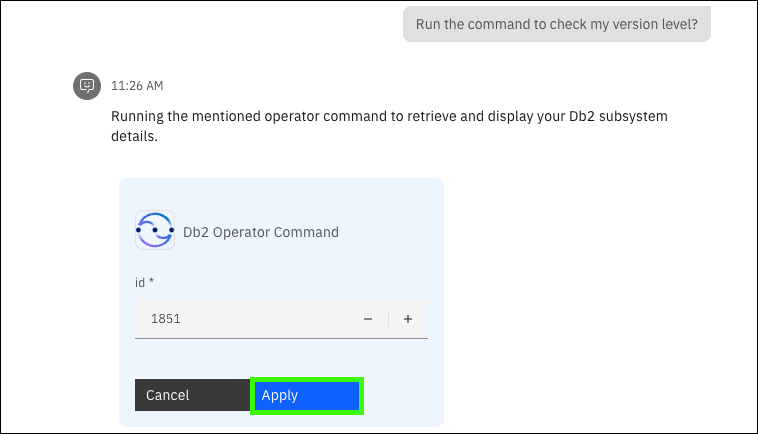

# Scenario: Db2 versioning
## Scenario overview
!!! Quote "Speaker's script"

    You are now a new database administrator and need to quickly familiarize yourself with the Db2 subsystem in the company's mainframe environment. You would like to understand more about Db2 on z/OS versus other platforms, the latest  supported version of Db2, and the process for migrating to a newer version. Most early-tenure DBAs don't have this experience. You leverage the virtual assistant that is customized with pre-existing automation your team has in place. And by leveraging the RAG grounded on Z-specific knowledge, you have confidence that the responses generated from the questions are accurate. You like the fact that you can go to one place to get answers to any question, on-demand, and can help automate some of the tasks, which in turn reduces your learning curve and increases your efficiency.

!!! Warning "Responses from the virtual assistant are likely to change"

    Responses generated by {{offering.name}} are likely to change over time. The responses you see when you run the queries may differ from the screen images captured in the {{guide.name}}. Using the exact queries specified will help assure a successful demonstration.

## Prerequisite steps
None.

## Prompts and sample outputs
??? Tip "Copy and paste the prompt"

    Use the copy icon () to copy prompts from the demonstration guide and then paste the prompt into the Assistant using ++ctrl+v++ or right click and select ```Paste```.

1. Ask the assistant what is different about Db2.   

    <!--- begin-tab-group --->
    === "Prompt"

        ```
        Why is Db2 different than other database systems?
        ```

    === "Sample output"

        !!! Quote "Speaker's script"

        Notice the detailed level of the response, and more importantly, notice the expandable section at the bottom of the response.

        
    <!--- end-tab-group --->

2. Ask the assistant how Db2 differs on the z/OS platform and distributed platforms.

    <!--- begin-tab-group --->
    === "Prompt"

        ```
        What is the difference between Db2 for z/OS and Db2 on distributed?
        ```

    === "Sample output"
        
    <!--- end-tab-group --->

3. Ask the assistant what is the latest release of Db2 for z/OS.
   
    <!--- begin-tab-group --->
    === "Prompt"

        ```
        What is the latest release of Db2 for z/OS?
        ```

    === "Sample output"
        
    <!--- end-tab-group --->

4. Ask the assistant what version of z/OS is required for Db2 v13.

    <!--- begin-tab-group --->
    === "Prompt"

        ```
        What version of z/OS does Db2 v13 run on?
        ```

    === "Sample output"
        
    <!--- end-tab-group --->

5. Ask the assistant how to check the version of Db2 on an LPAR.
   
    <!--- begin-tab-group --->
    === "Prompt"

        ```
        How do I check the Db2 for z/OS version on an LPAR using an operator command?
        ```

    === "Sample output"
        
    <!--- end-tab-group --->

6. Ask the assistant if it can run the version check?
   
    <!--- begin-tab-group --->
    === "Prompt"

        ```
        Can you run this command for me to check my version level?
        ```

    === "Sample output"
        
        !!! Quote "Speaker's script"

            A skill is triggered to use an Ansible playbook that runs the referenced operator command to return the Db2 details. 

        
    <!--- end-tab-group --->

7. Click **Apply**.

    <!--- begin-tab-group --->
    === "Sample input"

        

    === "Sample output"
    
        !!! Quote "Speaker's script"

            Here we see the skill has returned the version of Db2 running on the LPAR. 

        
    <!--- end-tab-group --->

8. Ask the assistant how to migrate from one version of Db2 to another.
   
    <!--- begin-tab-group --->
    === "Prompt"

        ```
        How do I migrate from Db2 v12 to Db2 v13 on z/OS?
        ```

    === "Sample output"
        
    <!--- end-tab-group --->

## Cleanup steps
None.
