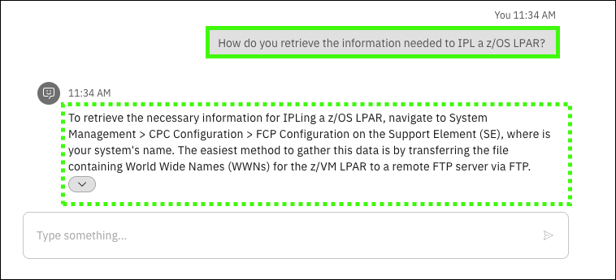
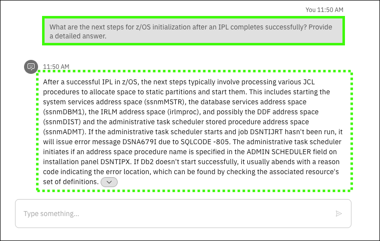

# Scenarios: Initial Program Load
## Scenario overview
!!! Quote "Speaker's script"

    You are now a Systems Programmer (sysprog) that is preparing for an upcoming IPL scheduled for one of your IBM Z systems. It’s been a while since you helped prepare for an IPL and we want to refamiliarize yourself with this process. Rather than spending time reading through the wide array of documentation available online, you leverage the conversational AI capabilities provided by IBM watsonx Assistant for Z to get accurate responses to your questions quickly, along with step-by-step guidance and links to documentation to learn more. When asking the assistant “How to perform an IPL on IBM Z?”, we realize there’s some information needed about our system, for example the IPL volume and the IPL LOAD PARM. The conversational skills capabilities provided by the assistant allows you to issue operator commands on the system directly within the assistant itself, serving as a one-stop shop for retrieving details required for the IPL process to go smoothly and increasing efficiency.

!!! Warning "Responses from the virtual assistant are likely to change"

    Responses generated by {{offering.name}} are likely to change over time. The responses you see when you run the queries may differ from the screen images captured in the {{guide.name}}. Using the exact queries specified will help assure a successful demonstration.

## Prerequisite steps
None.

## Prompts and sample outputs
??? Tip "Copy and paste the prompt"

    Use the copy icon () to copy prompts from the demonstration guide and then paste the prompt into the Assistant using ++ctrl+v++ or right click and select ```Paste```.

1. Ask the assistant what happens during an IPL.
    
    <!--- begin-tab-group --->
    === "Prompt"

        ```
        What happens during an IPL on IBM Z?
        ```

    === "Sample output"
        
    <!--- end-tab-group --->

2. Ask the assistance how to perform an IPL.

    <!--- begin-tab-group --->
    === "Prompt 2"

        ```
        How to perform an IPL on IBM Z? Provide a step by step guidance.
        ```

    === "Sample output"
        
    <!--- end-tab-group --->

3. Ask the assistant about the IPL LOAD PARM.

    <!--- begin-tab-group --->
    === "Prompt"

        ```
        What is the IPL LOAD PARM for my running system and database?
        ```

    === "Sample output"
        
    <!--- end-tab-group --->

4. Ask the assistant what the command is to find information about the IPL for the system.
   
    <!--- begin-tab-group --->
    === "Prompt"

        ```
        What is the operator command to find the IPL INFO for my system?
        ```

    === "Sample output"
        
    <!--- end-tab-group --->

5. Ask the assistant to run the command.

    <!--- begin-tab-group --->
    === "Prompt"

        ```
        Run command from operator console.
        ```

    === "Sample output"

        !!! Quote "Speaker's script"

            A skill is triggered to execute an operator command on the LPAR.
            
        
    <!--- end-tab-group --->

6. Enter ```D IPLINFO``` in the **extra-vars** entry field and click **Apply**.

    <!--- begin-tab-group --->
    === "Sample input"

        
    
    === "Sample output"

        

    <!--- end-tab-group --->

7. Click **Apply**.

    <!--- begin-tab-group --->
    === "Sample input"

        

    === "Sample output"
    
        !!! Quote "Speaker's script"

            In the output we see the last time the system was IPLed, the z/OS version, the IPL LOAD PARM (LOADK2 member in SYS0.IPLPARM), and the IPL boot volume (D25VS1).
    
        

    <!--- end-tab-group --->

8. Ask the assistant what needs to be done after an IPL finishes.
    
    <!--- begin-tab-group --->
    === "Prompt"

        ```
        What needs to be done after an IPL completes successfully? Provide a detailed answer.
        ```

    === "Sample output"   

        
    <!--- end-tab-group --->

## Cleanup steps
None.
