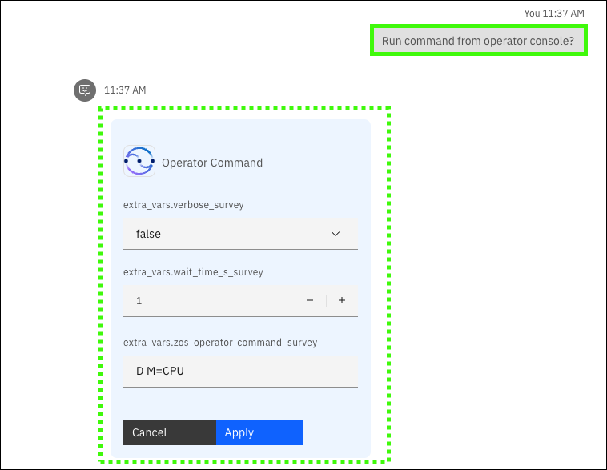
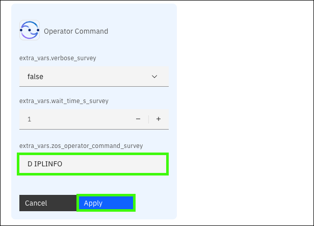
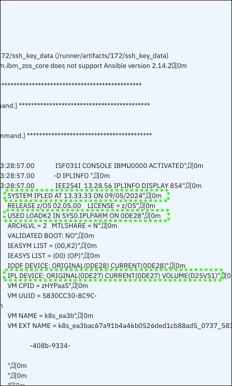

# Scenarios: Initial Program Load
## Scenario overview
!!! Quote "Speaker's script"

    Let us now switch roles to be a Systems Programmer (sysprog) that is preparing for an upcoming IPL scheduled for one of our IBM Z systems. It’s been a while since we helped prepare for an IPL and we want to refamiliarize themselves with this process. Rather than spending time reading through the wide array of documentation available online, we leverage the conversational AI capabilities provided by IBM watsonx Assistant for Z to get accurate responses to our questions quickly, along with step-by-step guidance and links to documentation to learn more. When asking the assistant “How to perform an IPL on IBM Z?”, we realize there’s some information that we must know about our system, for example the IPL volume and the IPL LOAD PARM. The conversational skills capabilities provided by the assistant allows us to issue operator commands on our system directly within the assistant itself, serving as a one-stop shop for retrieving any details required for the IPL process to go smoothly and increasing efficiency.

??? warning "Responses from the virtual assistant may change"

    Responses are subject to change as updates are made to {{offering.name}} and the LLM and RAG used in the demonstration environment. The responses you see when you run the queries may differ from the screen images captured in the {{guide.name}}.

## Prerequisites steps
None.

## Prompts and sample outputs
<!--- begin-tab-group --->
=== "Prompt 1"

    ```
    What happens during an IPL on IBM Z?
    ```

=== "Sample output"
    
<!--- end-tab-group --->
<!--- begin-tab-group --->
=== "Prompt 2"

    ```
    How to perform an IPL on IBM Z? Provide a step by step guidance.
    ```

=== "Sample output"
    
<!--- end-tab-group --->
<!--- begin-tab-group --->
=== "Prompt 3"

    ```
    What is the IPL LOAD PARM for my running system and database?
    ```

=== "Sample output"
    
<!--- end-tab-group --->
<!--- begin-tab-group --->
=== "Prompt 4"

    ```
    What is the operator command to find the IPL INFO for my system?
    ```

=== "Sample output"
    
<!--- end-tab-group --->
<!--- begin-tab-group --->
=== "Prompt 5"

    ```
    Run command from operator console.
    ```

=== "Sample output"
    
<!--- end-tab-group --->
!!! Abstract "Follow-up steps"

    <!--- begin-tab-group --->
    === "Actions"

        A skill is triggered to execute an operator command on the LPAR.
    
        1. Complete the form using these values: 
        
            - **Field 1**: <*Leave the default value.*>
            - **Field 2**: <*Leave the default value.*>
            - **extra-vars.zos_operator_command_survey**: D IPLINFO

        2. Click **Apply**.

            Another form will return showing the corresponding **ID** for the previous job.

        3. Click **Apply**.
   
            Review the output of the command, including **(a)** the last time the system was IPLed, the z/OS version, **(b)** the IPL LOAD PARM (LOADK2 member in SYS0.IPLPARM), and **(c)** the IPL boot volume (D25VS1).
    
    === "Sample input"
    
        
    
    === "Sample output"
    
        
    <!--- end-tab-group --->
<!--- end-tab-group --->
<!--- begin-tab-group --->
=== "Prompt 6"

    ```
    What needs to be done after an IPL completes successfully? Provide a detailed answer.
    ```

=== "Sample output"
    
<!--- end-tab-group --->
## Cleanup steps
None.
