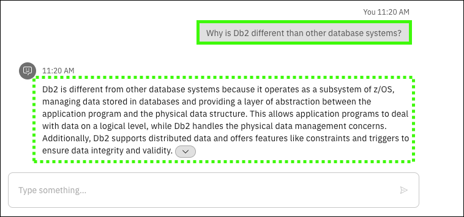
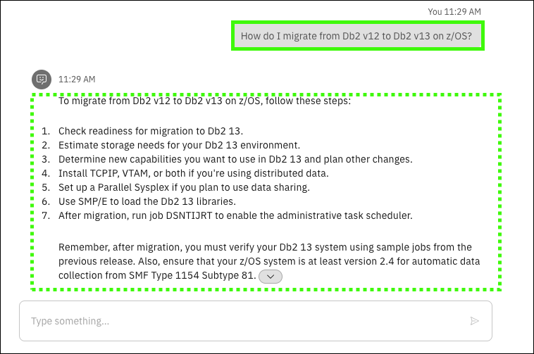

## Scenario overview

!!! Quote "Speaker's script"

    Let us now switch roles to be a Systems Programmer (sysprog) that is preparing for an upcoming IPL scheduled for one of our IBM Z systems. It’s been a while since we helped prepare for an IPL and we want to refamiliarize themselves with this process. Rather than spending time reading through the wide array of documentation available online, we leverage the conversational AI capabilities provided by IBM watsonx Assistant for Z to get accurate responses to our questions quickly, along with step-by-step guidance and links to documentation to learn more. When asking the assistant “How to perform an IPL on IBM Z?”, we realize there’s some information that we must know about our system, for example the IPL volume and the IPL LOAD PARM. The conversational skills capabilities provided by the assistant allows us to issue operator commands on our system directly within the assistant itself, serving as a one-stop shop for retrieving any details required for the IPL process to go smoothly and increasing efficiency.

??? warning "Responses from the virtual assistant may change"

    Responses are subject to change as updates are made to {{offering.name}} and the LLM and RAG used in the demonstration environment. The responses you see when you run the queries may differ from the screen images captured in the {{guide.name}}.

## Prerequisites steps
None.

## Prompts and sample outputs
<!--- begin-tab-group --->
=== "Prompt 1"

    ```Why is Db2 different than other database systems?```

=== "Sample output"
    
<!--- end-tab-group --->
<!--- begin-tab-group --->
=== "Prompt 2"

    ```What is the difference between Db2 for z/OS and Db2 on distributed?```

=== "Sample output"
    
<!--- end-tab-group --->
<!--- begin-tab-group --->
=== "Prompt 3"

    ```What is the latest release of Db2 for z/OS?```

=== "Sample output"
    
<!--- end-tab-group --->
<!--- begin-tab-group --->
=== "Prompt 4"

    ```What version of z/OS does Db2 v13 run on?```

=== "Sample output"
    
<!--- end-tab-group --->
<!--- begin-tab-group --->
=== "Prompt 5"

    ```How do I check the Db2 for z/OS version on an LPAR using an operator command?```

=== "Sample output"
    
<!--- end-tab-group --->
<!--- begin-tab-group --->
=== "Prompt 6"

    ```Can you run this command for me to check my version level```

=== "Sample output"
    
<!--- end-tab-group --->
!!! Abstract "Follow-up"

    <!--- begin-tab-group --->
    === "Actions"

        A skill is triggered to use an Ansible playbook that runs the referenced operator command to return the Db2 details. 
    
        1. Click **Apply**.

            Point out the Db2 version levels on the LPAR.

    === "Sample output"
    
        
    <!--- end-tab-group --->
<!--- end-tab-group --->
<!--- begin-tab-group --->
=== "Prompt 7"

    ```How do I migrate from Db2 v12 to Db2 v13 on z/OS?```

=== "Sample output"
    
<!--- end-tab-group --->
## Cleanup steps
None.

<!-- Terminology -->
*[LPAR]: Logical Partition
*[OS]: Operating System
*[RAG]: Retrieval-Augmented Generation
*[IPL]: Initial Program Load
*[AI]: Artificial Intelligence